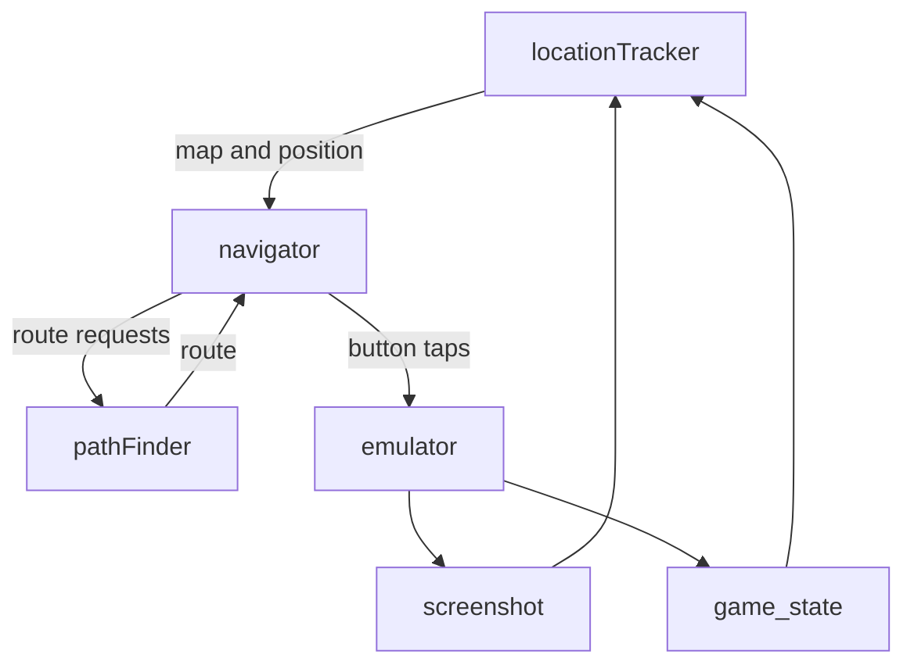

# Location Tracking in Pokemon

This is a set of tools and data sets to help automatically identify where the player character is in Pokemon Fire Red and Leaf Green.  

Originally the goal of this toolset was to try and mimic as much as possible how a human would identify where they were when playing the game.  This is why there are so many map screenshots, because a very quick version of this is to take a screenshot of the game and use tile matching to figure out where the player character is on the map.  Additionally, because of how unique each overworld map is, this also lets you figure out what map you are on in addition to where you are on it.  

However, tile matching by itself quickly runs into problems.  While the overwold sections of the game are all fairly unique in layout, many of the interriors of buildings all use the exact same map, only changing in NPC layout.  However, since most NPCs move around when in frame, it's very hard to add them to the map and use them as landmarks or identifiers.  As such, we fall back on pulling the game state from the emulator and reading which map we are on from that.  

Both tile matching and reading the game state gives us a map ID and relative location.  Using that info, we then figure out what we are nearby and what things we can get to within [the pathfinder](./pathfinder.py).  The pathing is based on the tile data we grabbed when labeling each tile of each map as walkable or not, and other special charactistics it might have had.  

## Pipeline



If it seems confusing, it's because it is.  As the goal of the project grew from just playing the first part of the game, to beating the entire thing, navigation went from just walking from Pallet Town to Pewter City to have to handle spaces blocked via HM moves, switches, items, etc.  

## Tools

| File | What it does |
| --- | --- |
| `mapEditor.py` | **The one editor.** Tile classification, map connections (with a click-to-pick Target Picker so you never type coordinates), item/object tagging (objects get a category), and grass-patch encounter tagging — all in one window with mode toggles. Replaces the old `tileClassifier.py` + `connectionEditor.py`. |
| `locationTracker.py` | Template-matches a screenshot to a map + tile. Searches the current map and its connection neighbors first (fast), full-scans only on low confidence. Uses `GAME_STATE`'s `map_bank`/`map_number` to disambiguate shared interiors. |
| `pathfinder.py` | Multi-map A* plus semantic routing: `planToLandmark`, `planToObjectCategory` (nearest Pokemon Center, ...), `planToItem`, `planToCatch` (nearest grass with a species). Handles object *approach* (stand adjacent + face), HM/badge-gated obstacles, and `@return` exits via a warp stack. |
| `navigator.py` | The LLM-facing closed loop: `goTo` / `goHeal` / `goCatch` / `collect`. Takes one step, re-observes, and replans on drift; reports battles/dialog as interruptions. |
| `encounterExtractor.py` | Optional: reads wild-encounter tables straight from the ROM to prefill grass patches (the editor's "Import from ROM"). Also dumps `encounterData/romEncounters.json` keyed by `(bank,number)`. |
| `validate.py` | Reports dataset problems: dangling connections, missing instances, unclassified tiles, grass patches without encounters, objects without a category. |
| `autoClassifier.py` | First-pass automatic tile classification by color/heuristics; refine in `mapEditor.py`. |

### Editor usage

```
python mapEditor.py                       # file picker
python mapEditor.py maps/PalletTown.png   # one map
python mapEditor.py --batch maps          # iterate the whole folder (n / p to page)
```

Modes (toolbar): **Tiles**, **Connections**, **Grass**. `Ctrl+S` saves both the
per-map tile JSON and `connectionData/connections.json`.

## Data formats

* `tileData/<mapName>.json` — `tiles[row][col]` type grid, plus `items` /
  `objects` / `objectCategories` (keyed `"row,col"`, legacy) and `grassPatches`
  (each with `[col,row]` tile lists and an `encounters` list).
* `connectionData/connections.json` — per-map `connections`, global `landmarks`,
  and an `instances` registry. A door/warp into a shared interior carries an
  `instance` id; the interior's exit uses the dynamic target `@return`, resolved
  at runtime against the warp stack.

**Coordinate convention:** the tile grid is `tiles[row][col]`; all coordinate
*points* are `[col, row]` (matching the pathfinder). The `items`/`objects` dict
keys remain `"row,col"` for backward compatibility with existing data.

## Resources

The maps for every location in the game are in the [maps folder](./maps/). 

The inspriration for this project came from looking at all the map data on [vgmaps.com](https://www.vgmaps.com/atlas/GBA/index.htm), which was a huge help. They have maps for tons of different games, so if you want to do something similar for another franchise, check them out.

I did eventually have to move from using their maps to grabing the map data directly from a decompiled version of fire red and leaf green hosted by [pret](https://github.com/pret/pokefirered).  This was very helpful for the indoor maps, because it let me grab the ingame background and borders too, which allowed all of the reference maps to be larger than the ingame screenshots.  
